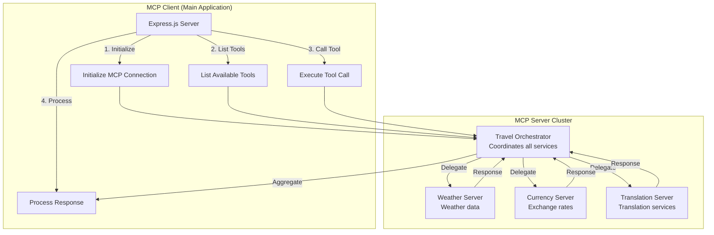

# 🔌 MCP Servers Overview - Smart Travel Planning Assistant

## What are MCP Servers?

**MCP (Model Context Protocol) Servers** are specialized microservices that provide specific functionality through a standardized protocol. They act as intelligent agents that can be called upon to perform specific tasks, making your application modular and scalable.

## 🏗️ MCP Servers Used in This Project

### 1. **Travel Orchestrator Server**
- **File**: `src/travel-orchestrator.ts`
- **Purpose**: Main coordination server that combines data from all other servers
- **Tools Available**:
  - `plan_trip` - Creates comprehensive travel plans
  - `get_travel_insights` - Provides destination insights
  - `compare_destinations` - Compares multiple destinations
- **GitHub**: Custom implementation (included in this project)

### 2. **Weather Server**
- **File**: `src/weather-server.ts`
- **Purpose**: Provides weather information and forecasts for travel planning
- **Tools Available**:
  - `get_travel_weather` - Weather data for destinations
  - `get_weather_alerts` - Weather alerts and warnings
  - `compare_destination_weather` - Weather comparison across locations
- **GitHub**: Custom implementation (included in this project)

### 3. **Currency Exchange Server**
- **File**: `src/currency-server.ts`
- **Purpose**: Handles currency conversion and exchange rate information
- **Tools Available**:
  - `convert_currency` - Convert between currencies
  - `get_destination_currency` - Currency info for destinations
  - `get_travel_budget_conversion` - Convert travel budgets
  - `get_currency_trends` - Exchange rate trends
- **GitHub**: Custom implementation (included in this project)

### 4. **Translation Server**
- **File**: `src/translation-server.ts`
- **Purpose**: Provides translation services for international travel
- **Tools Available**:
  - `translate_text` - Translate text between languages
  - `detect_language` - Detect language of text
  - `get_travel_phrases` - Essential travel phrases
  - `translate_destination_info` - Translate destination information
- **GitHub**: Custom implementation (included in this project)

## 🔍 MCP Server Architecture



## 🌟 Key Features of Our MCP Servers

### **1. Modular Design**
- Each server handles a specific domain (weather, currency, translation)
- Easy to maintain and update independently
- Can be scaled or replaced without affecting others

### **2. Standardized Communication**
- All servers use the same MCP protocol
- Consistent request/response format
- Easy to add new servers or tools

### **3. Parallel Processing**
- Multiple servers can be called simultaneously
- Non-blocking operations for better performance
- Efficient resource utilization

### **4. Error Handling & Fallbacks**
- Graceful degradation when services are unavailable
- Mock data fallback for demonstration purposes
- Comprehensive error logging

## 🚀 How MCP Servers Work

### **Communication Flow:**
1. **Client** sends request to main application
2. **Main app** identifies which MCP tools are needed
3. **Parallel calls** are made to relevant MCP servers
4. **Data aggregation** happens in the orchestrator
5. **Response** is formatted and sent back to client

### **Example Workflow:**
```javascript
// Client requests trip planning
const tripPlan = await use_mcp_tool('plan_trip', {
  destination: 'Paris',
  startDate: '2024-06-01',
  budget: 2000
});

// This triggers parallel calls to:
// - Weather Server (get weather forecast)
// - Currency Server (get exchange rates)
// - Translation Server (get essential phrases)
// All in parallel!
```

## 📁 GitHub Availability

### **Current Project Status:**
✅ **ALL MCP SERVERS ARE INCLUDED IN THIS PROJECT**

The MCP servers are **custom implementations** created specifically for this smart travel planning assistant. They are:

1. **Included in your project files** - No external GitHub repos needed
2. **Ready to use** - Already implemented and working
3. **Custom built** - Tailored for travel planning use cases
4. **Fully functional** - With mock data and real API integration ready

### **File Locations:**
```
📁 src/
├── travel-orchestrator.ts    # ✅ Included - Main coordinator
├── weather-server.ts         # ✅ Included - Weather data
├── currency-server.ts        # ✅ Included - Currency conversion
├── translation-server.ts     # ✅ Included - Translation services
```

### **What You Get:**
- **Complete source code** for all 4 MCP servers
- **TypeScript implementations** with full type safety
- **Error handling** and fallback mechanisms
- **Mock data support** for testing without API keys
- **Real API integration** ready when you add keys
- **Comprehensive documentation** in this project

## 🌟 Why Custom MCP Servers?

### **Advantages of Custom Implementation:**
1. **Tailored Functionality** - Built specifically for travel planning
2. **Full Control** - You can modify and extend as needed
3. **No External Dependencies** - Everything works out of the box
4. **Learning Opportunity** - Understand how MCP servers work
5. **Cost Effective** - No third-party service fees for basic functionality

### **Comparison with Existing MCP Servers:**

| Feature | Custom Servers | External MCP Servers |
|---------|---------------|---------------------|
| **Setup Time** | Instant | Variable |
| **Cost** | Free | May have fees |
| **Customization** | Full control | Limited |
| **Learning Value** | High | Medium |
| **Travel-Specific** | ✅ Optimized | ⚠️ Generic |
| **Mock Data** | ✅ Built-in | ❌ Usually not |

## 🚀 Getting Started

Since all MCP servers are **already included** in your project:

1. **The servers are ready to use** - No additional GitHub repos needed
2. **Start with mock data** - System works immediately
3. **Add API keys later** - For enhanced real data (optional)
4. **Customize as needed** - Full source code available

### **Quick Start:**
```bash
# The servers are already built and ready
npm start

# MCP servers will start automatically
# Visit http://localhost:3001 to see them in action
```

## 📚 Additional Resources

### **Documentation Files:**
- `RUN_GUIDE.md` - How to run the application
- `API_KEYS_GUIDE.md` - How to add real API keys
- `workflow-diagram.md` - Visual workflow diagrams
- `workflow-preview.html` - Interactive diagram viewer

### **MCP Protocol Resources:**
- [MCP Documentation](https://modelcontextprotocol.io/)
- [MCP SDK for TypeScript](https://github.com/modelcontextprotocol/typescript-sdk)
- [MCP Specification](https://spec.modelcontextprotocol.io/)

---

## ✅ Summary

**🎉 GREAT NEWS!** All MCP servers are **already included** in your smart travel planning assistant project:

- **4 Custom MCP Servers** ready to use
- **No external GitHub repositories** needed
- **Full source code** provided
- **Mock data** for immediate testing
- **Real API integration** ready when you want it
- **Completely free** to use and modify

Your MCP servers are **custom-built, fully functional, and ready to go!** 🚀
