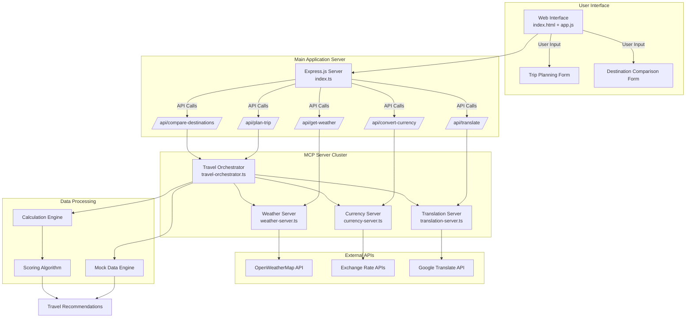
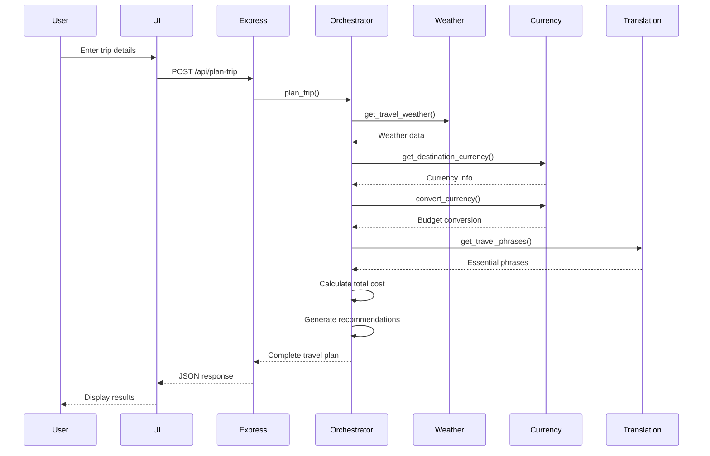
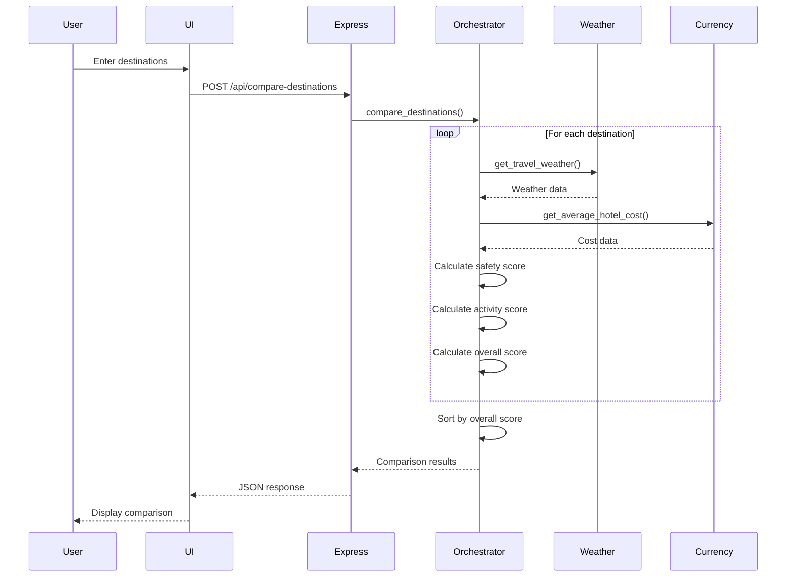
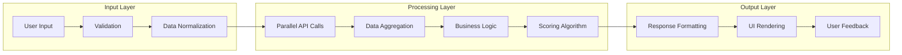
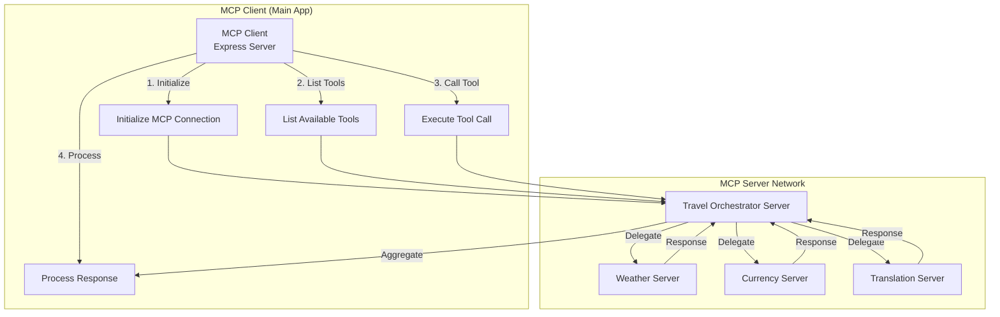
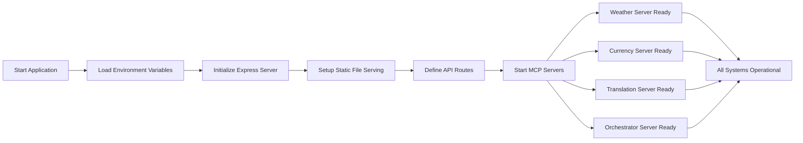
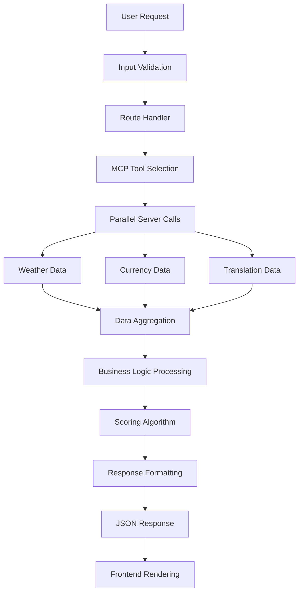
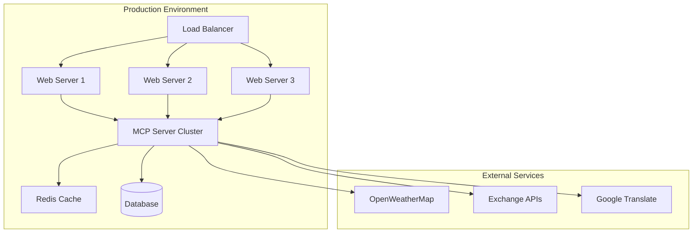

# 🌍 Smart Travel Planning Assistant - Workflow Diagram

## System Architecture Overview



## Detailed Workflow Process

### 1. Trip Planning Workflow



### 2. Destination Comparison Workflow



## Data Flow Architecture



## MCP Server Communication Flow



## Technical Implementation Details

### Server Initialization Flow


### Data Processing Pipeline


## Key Workflow Features

### 1. **Asynchronous Processing**
- All MCP server calls run in parallel
- Non-blocking I/O operations
- Efficient resource utilization

### 2. **Error Handling**
- Graceful degradation when services are unavailable
- Fallback to mock data for demonstration
- Comprehensive error logging

### 3. **Data Aggregation**
- Intelligent combination of multiple data sources
- Weighted scoring algorithms
- Personalized recommendations

### 4. **Real-time Updates**
- Live currency exchange rates
- Current weather conditions
- Dynamic pricing calculations

## API Integration Points

### External Service Connections
```yaml
Weather Server:
  - Endpoint: OpenWeatherMap API
  - Features: Current weather, forecasts, alerts
  - Fallback: Mock weather data

Currency Server:
  - Endpoint: Exchange Rate APIs
  - Features: Real-time rates, historical data
  - Fallback: Simulated exchange rates

Translation Server:
  - Endpoint: Google Translate API
  - Features: Text translation, language detection
  - Fallback: Mock translations
```

## Performance Optimizations

### 1. **Caching Strategy**
- Client-side caching for static assets
- Server-side caching for API responses
- Intelligent cache invalidation

### 2. **Load Balancing**
- MCP server health monitoring
- Automatic failover mechanisms
- Resource pooling

### 3. **Data Efficiency**
- Minimal data transfer
- Compressed responses
- Optimized database queries (when applicable)

## Security Considerations

### 1. **Input Validation**
- Sanitization of user inputs
- API rate limiting
- SQL injection prevention

### 2. **API Security**
- Environment variable protection
- API key management
- Secure communication protocols

### 3. **Data Privacy**
- No persistent user data storage
- Anonymous usage tracking
- GDPR compliance ready

## Deployment Architecture



## Summary

This workflow diagram illustrates the complete architecture of the Smart Travel Planning Assistant, showing:

1. **User Journey**: From web interface input to comprehensive travel recommendations
2. **MCP Server Integration**: How different services communicate and coordinate
3. **Data Flow**: Processing pipeline from raw inputs to final results
4. **External API Integration**: Connection points to third-party services
5. **Scalability**: Architecture ready for production deployment

The system uses a microservices approach with MCP servers, ensuring modularity, maintainability, and scalability for future enhancements.
